# Gait Analysis of Volumetric Muscle Loss in Rats {#sec-rat-vml}

## Introduction

Volumetric muscle loss (VML) causes permanent loss of functional muscle tissue and often leads to long-term deficits in strength, coordination, and locomotor performance. In both preclinical and clinical settings, histologic evidence of tissue remodeling does not always translate to functional recovery, making biomechanics a critical endpoint for evaluating treatment efficacy.

Rodent gait analysis paired with inverse dynamics provides a sensitive framework for detecting compensatory strategies that may persist even when gross behavior appears improved. Joint-level kinematic and kinetic metrics can reveal whether therapies restore native function or simply shift load to other joints and muscle groups.

This chapter compares long-term functional outcomes across six VML treatment strategies using spatiotemporal parameters, gait kinematics, and inverse-dynamics joint moments. The primary objective is to determine which interventions most effectively reduce pathological gait compensations relative to no repair and to an uninjured control dataset.

## Methods

### Experimental Design

Forty-eight 12-week-old female Lewis rats were divided into six treatment groups, with eight rats per group. A 20% by-mass volumetric muscle loss (VML) injury was created in the left lateral gastrocnemius (LG) muscle of each animal. The first group was a *No Repair (NR)* control, where the injury site was left empty. The second group received a *Tissue-Engineered Muscle Repair (TEMR)*, which involved filling the site with a cell-seeded bioscaffold. The third and fourth groups received acellular treatments, consisting of either a pro-regenerative *Healy Hydrogel (HH)* or a porous collagen *Healy Sponge (HS)*. The final two groups received combination treatments: one group was given the *TEMR construct with the Healy Hydrogel (TEMR+HH)*, and the other received the *TEMR construct with an acellular keratin gel (TEMR+KG)*. Functional assessment was performed 24 weeks post-surgery and each group was compared to the group that received no repair to clarify trends in recovery or decline. A previously collected dataset of 32 animals was used as the *Control* group.

### Animal Care and Surgical Procedures

All animal procedures were approved by the University of Virginia Animal Care and Use Committee and conducted in compliance with the _Guide for the Care and Use of Laboratory Animals_, the Animal Welfare Act, and implementing Animal Welfare Regulations. Lewis rats (Charles River Laboratories) were pair-housed in a vivarium accredited by the American Association for the Accreditation of Laboratory Animal Care with ad libitum access to food and water.

The VML injury surgery was performed in accordance with previously published methods (TODO: add Merritt citation key). The LG was exposed and a 20% distal portion was excised by mass. The assigned repair material was then implanted into the defect following published methodologies (TODO: add Corona/Machingal citation keys). No repair material was implanted in the No Repair (NR) group. The overlying fascia was closed with 6-0 vicryl sutures, and the skin was closed with 5-0 prolene interrupted sutures with skin glue to reduce risk of wound reopening.

Prior to surgery, slow-release buprenorphine was administered (0.1 mg/kg, subcutaneously). All surgical procedures along with shaving and motion capture marker placement were performed under continuous isoflurane anesthesia inhalation (1.5–2.5%). The depth of anesthesia was monitored by the response of the animal to a slight toe pinch, where the lack of response was considered the surgical plane of anesthesia. A heated water perfusion system was utilized for core temperature maintenance. Post-operative analgesia was provided with quick-release buprenorphine (0.1 mg/kg, subcutaneously) at 36 and 48 hours. No animal required additional analgesia after 48 hours post-surgery as determined by veterinary staff that monitored for pain and distress. 

### Motion Capture and Gait Analysis

After 24 weeks to allow for injury progression or healing, gait data was collected for each rat in the treatment groups. Reflective markers were adhered to bony landmarks on the pelvis and joint locations on the hindlimb based on the set described by Johnson et al. (2008) and utilized in previous studies by this group (Dienes 2019, 2022). Marker locations were: (1) L6 vertebra, (2) 5th caudal vertebra, (3-4) left and right anterior iliac crests, (5-6) left and right greater trochanter of the femur, (7-8) left and right lateral femoral epicondyle, (9-10) left and right lateral malleolus, and (11-12) left and right lateral aspect of the distal end of the 5th metatarsal. After an acclimation period, rats walked along an instrumented walkway while motion was captured with a seven-camera Vicon system recording marker data at 200Hz and synchronized with four in-ground ATI six-axis force transducers recording ground reaction forces at 1000 Hz. A minimum of three successful trials wherein one complete steady-state gait cycle, defined from foot strike to foot strike, per hindlimb without overlap on a force plate during stance phase were collected for each rat.

### Gait Modeling and Statistical Analysis

Marker trajectories and ground reaction force data were filtered using a 4th-order low-pass Butterworth filter (cutoff frequencies 15 Hz and 100 Hz, respectively). For each rat, a subject-specific OpenSim model of the hindlimbs was generated from limb measurements and previously acquired limb anthropometrics [@dienesAnalysisModelingRat2019; @hicksKinematicKineticGait2023]. OpenSim inverse kinematics and inverse dynamics tools were used to compute hindlimb joint angles and joint moments. Reported data correspond to one gait cycle, with stance and swing of the right stride reported independently to minimize apparent phase differences caused by velocity variation.

Moments were normalized to total body mass multiplied by total body length, consistent with common biomechanics practice [@winter]. Limitations of this normalization strategy are addressed in the Discussion. Spatiotemporal parameters (STPs) were calculated in Vicon Nexus using standard definitions (TODO: add Huxley citation key). At the 24-week endpoint, STPs were compared between each treatment and the NR group using unpaired two-sided t-tests. For time-series kinematic and kinetic data, Statistical Parametric Mapping (SPM) with unpaired t-tests was used to identify significant regions across the gait cycle [@Pataky-Robinson-Vanrenterghem-2016].

Because multiple endpoints and waveform regions were examined, these analyses should be interpreted as comparative and exploratory in this chapter. Significance was set at alpha = 0.05. In figures, red highlighted regions indicate significant difference versus NR, and black highlighted regions indicate significant difference versus Control.

## Results

### Spatiotemporal Parameters

Stride length, step width, and velocity are normalized by leg length calculated by summing the femur and tibia lengths.

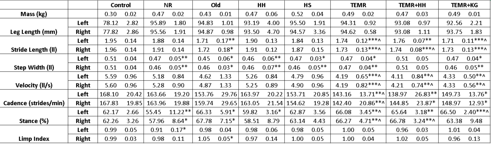{#fig-vml-stp-table}

*^, ^^, ^^^ indicates p < 0.05, 0.01, 0.001 respectively compared to NR*

*\*, \*\*, \*\*\* indicates p < 0.05, 0.01, 0.001 respectively compared to Control*

The No Repair group had a significantly narrower step width and decreased stance percentage compared to the control group. This narrower step width was reflected in nearly every other treatment except the TEMR+HH group.
All groups that received some form of TEMR treatment moved significantly slower compared to both the Control and No Repair groups. This was coupled with significant increases in stance percentages and decreases in stride lengths compared to the Control group. 

### Kinematics and Kinetics

#### No Repair (NR)

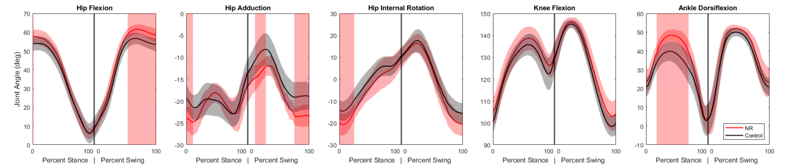{#fig-vml-nr-kinematics}
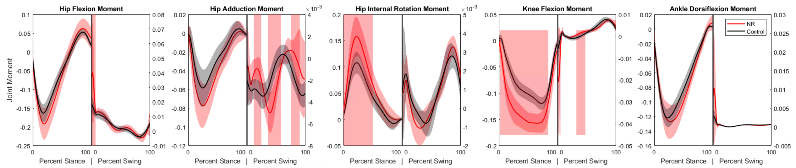{#fig-vml-nr-kinetics}

The primary differences seen in the No Repair group compared to the control dataset were an increased ankle dorsiflexion angle during mid-stance coupled with increases in the knee extension and hip internal rotation moments. These changes suggest that to compensate for the loss of plantarflexor function, the animals are adopting a gait strategy that reduces the demand on the ankle joint by increasing dorsiflexion and utilizing more proximal musculature to generate the necessary extension moments at the knee and hip. Effective therapies would be expected to mitigate these compensations and restore more normal kinematic and kinetic patterns.

#### Healy Hydrogel (HH)

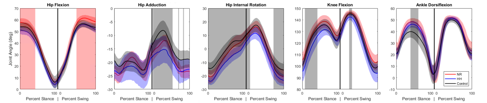{#fig-vml-hh-kinematics}
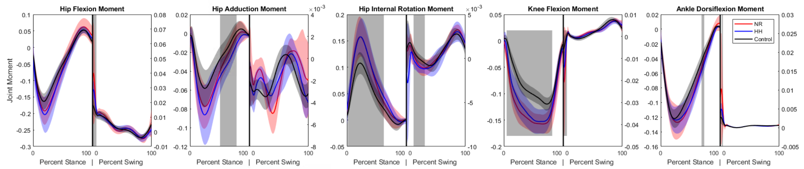{#fig-vml-hh-kinetics}

The Healy Hydrogel group demonstrated very similar kinematic and kinetic patterns to the No Repair group, with increased ankle dorsiflexion during mid-stance and elevated knee extension and hip internal rotation moments. Significance was also seen in some other kinematic measures, but this is likely a result of variability in marker placement. This suggests that the hydrogel alone did not provide sufficient functional recovery to alter the compensatory gait strategies observed in the No Repair group.

#### Healy Sponge (HS)

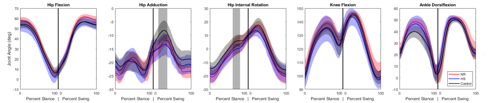{#fig-vml-hs-kinematics}
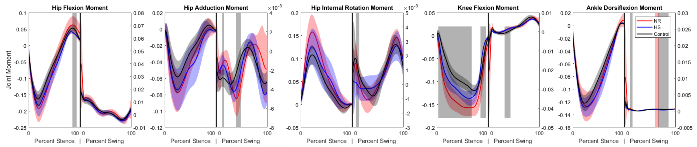{#fig-vml-hs-kinetics}

The Healy Sponge group exhibited kinematic and kinetic patterns more similar to the Control group compared to the No Repair and Healy Hydrogel groups. While some significant difference remained in the knee extension moment, the curve shifted away from the trajectory seen in the No Repair group and towards the Control group, and the overall patterns suggested a trend toward normalization of gait mechanics. The difference in ankle dorsiflexion angle did not reach the level of significance compared to either the Control or No Repair groups, but visual inspection of the curves suggests it is still closer to the No Repair values, and the lack of significance is more likely a result of a higher variance. This indicates that the sponge may have provided a more conducive environment for muscle regeneration or functional compensation compared to the hydrogel.

#### Tissue-Engineered Muscle Repair Combination Therapies

Many of the TEMR groups exhibited similar patterns and will be analyzed together.

#### Tissue-Engineered Muscle Repair (TEMR)

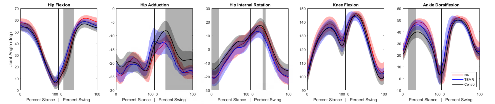{#fig-vml-temr-kinematics}
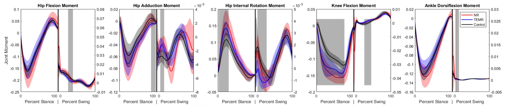{#fig-vml-temr-kinetics}

#### TEMR and Hydrogel (TEMR+HH)

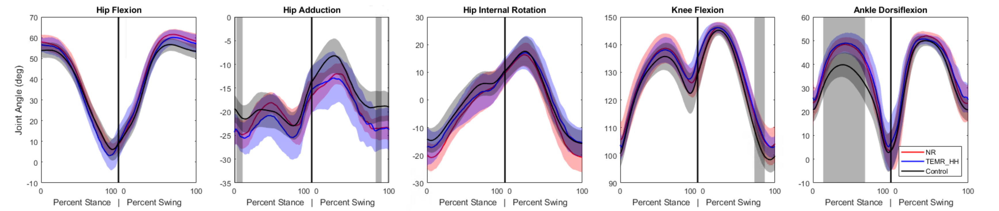{#fig-vml-temr-hh-kinematics}
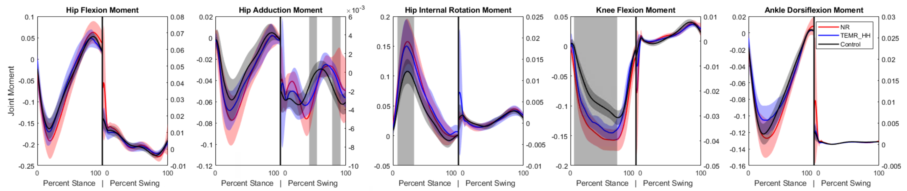{#fig-vml-temr-hh-kinetics}

#### TEMR and Keratin Gel (TEMR+KG)

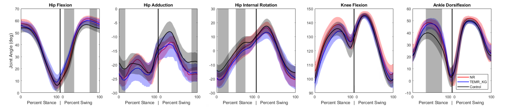{#fig-vml-temr-kg-kinematics}
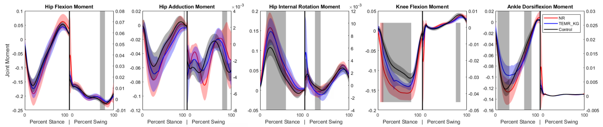{#fig-vml-temr-kg-kinetics}

Kinematically, the ankle dorsiflexion angle is still significantly elevated in mid-stance compared to Control. The kinetic profile across all three TEMR groups is similar, with decreased knee extension moment during stance compared to the No Repair group but still significantly greater than the Control group. Similarly, the hip internal rotation moments are significantly greater than Control in mid-stance, akin to the No Repair group. A unique adaptation that surfaces in the TEMR groups is a decrease in ankle plantarflexion moment compared to both the Control and No Repair groups during mid-stance. These findings suggest that while the TEMR treatments may not fully restore normal gait mechanics, they do introduce unique compensatory strategies, particularly at the ankle joint.
 
## Discussion

### Summary of Findings

This study provides a biomechanical comparison of multiple treatment strategies for VML in a rat model at a long-term endpoint. The No Repair group exhibited compensatory gait adaptations, including increased ankle dorsiflexion and elevated knee and hip moments, consistent with persistent plantarflexor impairment. Broadly, treatment groups retained elements of this compensation pattern, suggesting incomplete restoration of native mechanics.

The Healy Hydrogel group was most similar to No Repair. The Healy Sponge group showed the clearest trend toward normalization in several kinematic and kinetic features, though not a complete return to control-like behavior. TEMR-based treatments did not fully restore normal gait but appeared to alter compensation patterns, particularly through ankle moment behavior during stance.

### Limitations and Future Directions

In this study, joint moments were normalized to body mass multiplied by total length to account for size differences and facilitate group comparison. However, this strategy assumes geometric scaling relationships that may not fully capture age-related or segment-specific growth effects in rodents. The use of a previously collected control dataset is another limitation, because even with similar acquisition protocols, cross-cohort differences can influence apparent group effects.

This analysis is also limited to a single terminal time point and net joint moments. A longitudinal design would better resolve the timing and progression of compensatory adaptations, while muscle-level simulations (for example, computed muscle control) could help partition net moments into candidate muscle force contributions. Future work should also include age-matched uninjured controls and evaluate alternative normalization strategies that account for differential segment growth (for example, tibia-femur disproportionality).

Finally, integrating biomechanical outcomes with histologic and molecular measurements would improve mechanistic interpretation and help distinguish therapies that produce true functional regeneration from those that primarily redistribute mechanical demand.

## Conclusion

Volumetric muscle loss causes functional impairments that are not adequately addressed by current clinical practice. This study provides a broad comparison of the long-term functional efficacy of several preclinical regenerative strategies. We found that while no treatment achieved a full return to uninjured function, therapies incorporating a specific sponge material produced modest but significant trends toward functional healing, demonstrating mitigated pathological gait compensations. This work emphasizes the utility and importance of detailed biomechanical assessment in evaluating VML treatments and highlights the potential of biomaterials to enhance regenerative outcomes.
