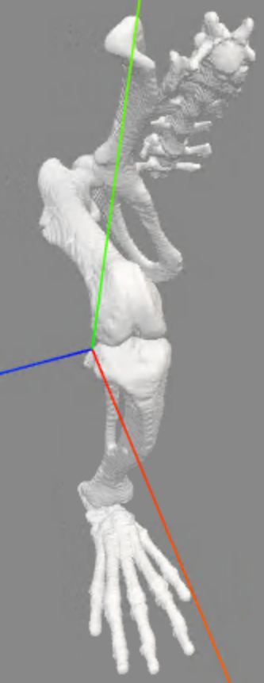

# Bilateral Rat Model Refinement

## Introduction

Musculoskeletal simulation of rodent locomotion requires a detailed and physiologically accurate model. The most widely used rat hindlimb model for OpenSim was developed by @johnsonThreedimensionalModelRat2008 and made available on [SimTK](https://simtk.org/projects/rat_hlimb_model). This model has been used in a number of subsequent studies, including functional electrical stimulation applications [@johnsonApplicationRatHindlimb2011], cross-species comparison [@charlesMusculoskeletalGeometryMuscle2016], and gait analysis in injury models [@dienesAnalysisModelingRat2019; @hicksKinematicKineticGait2023]. However, the original model is unilateral, relies on older OpenSim conventions, and contains several features that limit its accuracy when scaled to individual subjects or used for muscle-level analyses.

In this chapter, we describe the refinement and extension of the Johnson model into a bilateral rat hindlimb model suitable for subject-specific musculoskeletal simulation. The modifications include: (1) general modernization of naming conventions and coordinate definitions, (2) correction of the knee joint definition to improve scaling behavior, (3) replacement of wrapping-surface-based muscle paths with via-point paths derived from the Animatlab model of @youngNeuromechanicalRatModel2018, (4) conversion from Thelen to Millard muscle dynamics, (5) updated muscle architectural parameters, and (6) mirroring of the right-side anatomy to produce a complete bilateral model. The up-to-date model, version history, and processing code are maintained in the [`rat-hindlimb-model` repository](https://github.com/hudsonburke/rat-hindlimb-model).

### Prior Work

The Johnson model [@johnsonThreedimensionalModelRat2008] was the first three-dimensional musculoskeletal model of the rat hindlimb for OpenSim. It defined 13 degrees of freedom across the hip, knee, and ankle joints with 42 musculotendon actuators and was used by @johnsonApplicationRatHindlimb2011 to study functional electrical stimulation of the rat hindlimb. @engScalingMuscleArchitecture2008 provided scaling relationships for muscle architectural parameters across species, and @charlesMusculoskeletalGeometryMuscle2016 developed a comparable mouse hindlimb model with detailed musculoskeletal geometry.

Several more recent efforts have built on or adapted the Johnson model. @youngNeuromechanicalRatModel2018 created a detailed neuromechanical rat model in Animatlab software, defining comprehensive muscle attachment points based on @greeneAnatomyRat rather than relying on wrapping surfaces. @youngAnalyzingMomentArm2019 subsequently validated moment arm profiles from that model. @ramalingasettyWholeBodyMusculoskeletalModel2021 developed a whole-body mouse musculoskeletal model and applied a tendon slack length optimization approach relevant to smaller-scale models. @huntUsingAnimalData2015 explored the use of animal models for neuromechanical simulation, providing context for the broader utility of rodent musculoskeletal models.

On the experimental side, @dienesAnalysisModelingRat2019 and @hicksKinematicKineticGait2023 used scaled versions of the Johnson model for gait analysis in the context of volumetric muscle loss injury, which directly motivated the model improvements described here.

## Methods

### General Modernization

Several structural updates were made to bring the model in line with current OpenSim conventions and to prepare it for bilateral extension. All body and joint names on the right side were given a `_r` suffix (e.g., `femur` became `femur_r`, `knee` became `knee_r`) to allow unambiguous identification after mirroring. Bone geometry files were converted from VTK `.vtp` format to `.stl` format for compatibility with common mesh processing tools.

Degrees of freedom that are not actively used in typical rat gait analyses were locked to reduce model complexity and avoid non-physiological solutions during inverse kinematics or computed muscle control. The locked coordinates include ankle adduction (`ankle_r_add`), ankle internal rotation (`ankle_r_int`), and sacroiliac flexion (`sacroiliac_r_flx`). The marker set was also updated to match the marker placement protocol used in our laboratory's experimental studies [@dienesAnalysisModelingRat2019; @hicksKinematicKineticGait2023].

### Knee Joint Definition

In Johnson's original model, the tibia offset frame used as the parent frame for the knee joint is defined at the distal end of the tibia, and the spatial transform is governed by a `SimmSpline` component that encodes the non-linear translation of the tibia relative to the femur as a function of knee flexion angle. When the model is scaled to subject-specific parameters, the knee motion becomes incorrect because the `SimmSpline` trajectory does not change with scaling and the tibia offset frame remains fixed, so there is nothing to account for the new tibia length.

To correct this, we repositioned the tibia offset frame to the approximate joint center of the knee as determined by the instantaneous center of rotation (ICR). The ICR was computed by moving the knee through its full range of motion, sampling the position of the tibia origin at each configuration, and projecting these points into the sagittal plane to identify the center of the arc. The resulting offset frame location was set to $[-0.00057, 0.0400, 0.0038]$ m in the tibia body frame. The `SimmSpline` functions governing the three translational components of the spatial transform were re-fit with 14 control points each to preserve the original non-linear knee kinematics while referencing the new frame location. A constant rotation of 0.262 rad (15°) was applied about the third rotation axis to maintain the resting knee angle. The effect of this change is illustrated in @fig-knee.

{#fig-knee}

### Inertial Parameters

Inertial properties were updated based on the methodology described by @hicksKinematicKineticGait2023, who derived segment-specific inertial parameters from cadaveric measurements and geometric approximations of limb segments as uniform-density solids. These values are used during inverse dynamics to compute net joint moments from measured kinematics and ground reaction forces.

### Muscle Path Analysis {#sec-muscle-path-analysis}

In analyzing the original Johnson rat model, we observed that several muscles exhibited discontinuous changes in length during joint rotations. This behavior is non-physiological and can lead to inaccuracies in simulations of muscle function, particularly when computing muscle forces or tendon slack lengths that depend on smoothly varying musculotendon length curves.

The model was moved through its full range of motion and muscle lengths were analyzed to identify discontinuities. The `OsimGraph` class from the [`osimpy`](https://github.com/hudsonburke/osimpy) library was used to represent the OpenSim model as a graph structure, which enables efficient querying of musculotendon length as a function of joint coordinates. The following muscles were identified as having discontinuous length changes:

- BFa (biceps femoris anterior)
- CF (caudofemoralis)
- STp (semitendinosus posterior)
- TA (tibialis anterior)
- VL (vastus lateralis)

Investigating the root cause, we found that the likely culprit is a hard-coded value in [OpenSim's `WrapCylinder.cpp` code](https://github.com/opensim-org/opensim-core/blob/f9cd558ec3ea99dda206e5e412e62e23cf19bd7e/OpenSim/Simulation/Wrap/WrapCylinder.cpp#L668) that determines the number of segments used to approximate the muscle path over a wrapping cylinder:

```c
// Each muscle segment on the surface of the cylinder should be
// 0.002 meters long. This assumes the model is in meters, of course.
int numWrapSegments = (int)(aWrapResult.wrap_path_length / 0.002);
if (numWrapSegments < 1) numWrapSegments = 1;
```

This segment length of 0.002 m is appropriate for human-scale models but is problematic for the rat model, where wrapping cylinders have much smaller circumferences. With fewer discretization segments, the muscle path changes abruptly as it wraps and unwraps, producing step-like discontinuities in musculotendon length. To address this, we chose to replace the wrapping-surface-based muscle paths with via-point paths derived from a more anatomically detailed model.

### Muscle Path Redefinition

Johnson's original model relied heavily on wrapping surfaces to guide muscle paths around bones and joints. A more recent model by @youngNeuromechanicalRatModel2018, which built upon the Johnson model and drew from the original anatomical text of @greeneAnatomyRat, defined comprehensive muscle attachment and via-point coordinates for all hindlimb muscles instead of relying on wrapping surfaces. This via-point approach avoids the discretization artifacts described above and provides a more physiologically faithful representation of muscle paths at small scales.

Unfortunately, the Young model was created for the [Animatlab](https://www.animatlab.com/) neuromechanical simulation platform, and no OpenSim version existed. We obtained the original Animatlab files with the assistance of Dr. Young and manually recorded the muscle attachment points from the model. The complete set of attachment coordinates is provided in @sec-young-attachments.

#### Coordinate System Transformation via Mesh Registration

The coordinate systems used in Animatlab differ from those in OpenSim, so a direct transfer of attachment coordinates is not possible. To determine the necessary transformations, we performed mesh registration to align the bone geometries from the Animatlab model to those in our OpenSim model. Once aligned, the same transformation could be applied to the muscle attachment points to bring them into the OpenSim coordinate system.

We used the [`open3d`](http://www.open3d.org/) library [@zhouOpen3DModernLibrary2018] for the mesh registration pipeline, which proceeded as follows:

1. **Deterministic preprocessing**: Mesh vertices were sorted lexicographically and both source (Animatlab) and target (OpenSim) meshes were normalized to unit size centered at the origin. Threading was restricted to a single thread (`OMP_NUM_THREADS=1`) to ensure deterministic RANSAC results.
2. **Global registration**: Fast Point Feature Histograms (FPFH) were computed from 5,000 sampled surface points with a normal estimation radius of 0.1. RANSAC-based global registration was performed with 3-point correspondence sets, mutual correspondence checking, and a maximum of 100,000 iterations.
3. **Local refinement**: Point-to-point Iterative Closest Point (ICP) registration with scaling was applied to refine the alignment from the global registration step.
4. **De-normalization**: The combined transformation was mapped back to the original target coordinate system to produce a 4×4 transformation matrix applicable to muscle attachment coordinates.

This registration was performed independently for each body segment (spine, pelvis, femur, tibia, and foot), producing body-specific transformation matrices. For each muscle, the attachment points from the Young model were then transformed into the OpenSim coordinate system using the transformation matrix corresponding to the attachment's parent body. All existing wrapping geometries were removed and replaced with the transformed via-point paths.

### Muscle Parameters {#sec-musc-params}

#### Muscle Model Conversion

The original Johnson model uses the Thelen2003 muscle model [@thelenAdjustmentMuscleMechanics2003], which has been largely superseded by the Millard2012 equilibrium muscle model [@millardFlexingComputationalMuscle2013] in OpenSim. The Millard model provides improved numerical stability and more physiologically grounded force-length-velocity curves, making it better suited for muscle-level analyses such as computed muscle control. All 42 muscles were converted from `Thelen2003Muscle` to `Millard2012EquilibriumMuscle` components, preserving the original values of maximum isometric force, optimal fiber length, tendon slack length, and pennation angle at optimal fiber length. A default fiber damping coefficient of 0.1 was applied to all muscles.

#### Architectural Parameters

Muscle architectural parameters (maximum isometric force ($F_o$), optimal fiber length ($l^m_o$), and pennation angle at optimal fiber length ($\theta_o$))were taken from the measurements reported by @johnsonApplicationRatHindlimb2011. These parameters span a wide range across the 42 muscles in the model: maximum isometric force ranges from 0.25 N (extensor hallucis longus) to 18.74 N (semimembranosus), optimal fiber length from 4.2 mm (popliteus) to 43.6 mm (gracilis anterior), and pennation angle from 0° (several muscles) to 25.4° (tibialis posterior).

#### Tendon Slack Length

Tendon slack length ($l^t_s$) is one of the most influential parameters in Hill-type muscle models, yet it cannot be measured directly and must be estimated indirectly. Johnson's original tendon slack length values were derived from anatomical measurements, but the literature has shown that such values can contain substantial errors [@manalSubjectSpecificEstimatesTendon2004]. As described in detail in @sec-tsl-optimization, we applied a numerical optimization approach to estimate tendon slack lengths for all muscles in the model. Muscles for which the optimization yielded a tendon slack length of zero were set to have rigid tendons by enabling the `ignore_tendon_compliance` flag. When both full range-of-motion and gait-specific optimized values were available, the gait-specific (walking) values were used in the final model, as the model's full range of motion includes physiologically infeasible configurations that bias the optimization.

### Bilateral Mirroring

To create a bilateral model suitable for studies involving both hindlimbs, all right-side anatomy was mirrored to the left side. The mirroring was performed as follows:

#### Body Segments

For each body segment (pelvis, femur, tibia, foot), the right-side body was cloned and renamed with a `_l` suffix. The bone geometry meshes were reflected across the sagittal (XY) plane by negating the Z-axis scale factor. The center of mass location was mirrored by negating the Z component, while moments of inertia ($I_{xx}$, $I_{yy}$, $I_{zz}$) were preserved and the products of inertia that cross the mirror plane were negated.

#### Joints

Each `CustomJoint` was cloned and renamed. Frame translation offsets were mirrored by negating the Z component. The spatial transform functions governing joint kinematics were mirrored according to their type: `SimmSpline` Y-coordinate values were negated to reverse the curve, `LinearFunction` slopes and intercepts were negated, `Constant` values were negated, and `MultiplierFunction` scale factors were negated. This ensures that left-side joint motion is mirror-symmetric to the right side.

#### Muscles

Each muscle was cloned and renamed (e.g., `R_RF` became `L_RF`). All muscle path point coordinates were mirrored by negating the Z component, producing the correct medial-lateral orientation for the left side.

#### Marker Set

The marker set was updated to include bilateral markers, with left-side markers placed at the mirrored locations of their right-side counterparts.

The final bilateral model contains the full complement of bodies, joints, and muscles for both hindlimbs, enabling analyses that require bilateral kinematics and kinetics such as those described in @sec-rat-vml.

## Results

The pipeline produces four model variants:

- `rat_hindlimb_unilateral.osim` — right-side model with muscles
- `rat_hindlimb_unilateral_no_muscles.osim` — right-side skeleton only
- `rat_hindlimb_bilateral.osim` — bilateral model with muscles
- `rat_hindlimb_bilateral_no_muscles.osim` — bilateral skeleton only

### Muscle Path Continuity

After replacing the wrapping-surface-based muscle paths with via-point paths from the Young model, the discontinuous muscle length changes observed in the original Johnson model (BFa, CF, STp, TA, and VL; @sec-muscle-path-analysis) were eliminated. All muscles now exhibit smooth, continuous length changes across the full range of joint motion.

TODO: Plot

### Muscle Parameters

The final model contains 42 muscles per side (84 total in the bilateral model), all using the Millard2012 equilibrium muscle model. Architectural parameters (maximum isometric force, optimal fiber length, and pennation angle) are taken from @johnsonApplicationRatHindlimb2011. Tendon slack lengths were estimated via the optimization methodology described in @sec-tsl-optimization, with walking-phase values used when available. A comparison of the original Johnson tendon slack lengths and the optimized values is provided in @tbl-tsl-comparison of @sec-tsl-optimization.

### Bilateral Symmetry

The mirrored left-side anatomy is geometrically symmetric to the right side across the sagittal plane. Joint kinematics, muscle paths, and inertial properties are consistent between sides, enabling direct bilateral comparison of kinematic and kinetic outcomes in experimental studies.

## Discussion

### Summary

We have described the refinement of the Johnson rat hindlimb model [@johnsonThreedimensionalModelRat2008] into a modernized, bilateral musculoskeletal model suitable for subject-specific simulation. The key improvements include a corrected knee joint definition that scales appropriately with subject-specific tibia length, replacement of wrapping-surface muscle paths with anatomically detailed via-point paths from the Young Animatlab model [@youngNeuromechanicalRatModel2018], conversion to the Millard2012 muscle model, numerically optimized tendon slack lengths, and bilateral mirroring.

### Muscle Path Improvements

The replacement of wrapping surfaces with via-point paths resolved the discontinuous muscle length artifacts that affected five muscles in the original model. These artifacts arose from the interaction of the rat model's small geometry with a hard-coded segment length in OpenSim's wrapping surface implementation. While modifying the OpenSim source code would be an alternative solution, the via-point approach has the advantage of being model-level and therefore portable across OpenSim versions. The via-point paths from the Young model also benefit from being based on detailed anatomical dissection data [@greeneAnatomyRat], rather than the approximate cylindrical wrapping surfaces used in the original model.

The mesh registration approach used to transfer attachment points between coordinate systems introduces some spatial error inherent to the ICP alignment. However, the registration was performed on a per-segment basis using deterministic seeding, and the resulting muscle length profiles are smooth and physiologically plausible across the full range of motion.

### Knee Joint Definition

The repositioning of the tibia offset frame to the instantaneous center of rotation of the knee is a critical change for subject-specific scaling. In the original model, scaling the tibia length did not appropriately adjust knee kinematics because the spatial transform functions were defined relative to the distal tibia rather than the joint center. The corrected definition ensures that the knee joint center remains at the proper anatomical location after scaling, producing more accurate kinematics in scaled models.

### Muscle Model and Parameters

The conversion from `Thelen2003` to `Millard2012` muscle dynamics aligns the model with current best practices in OpenSim musculoskeletal modeling. The Millard model's improved numerical properties are particularly important for the computed muscle control analyses used in subsequent chapters. The optimization of tendon slack lengths, described in detail in @sec-tsl-optimization, addresses one of the most influential and difficult-to-measure parameters in Hill-type muscle models.

### Reproducibility

All model modifications are implemented as a sequence of Jupyter notebooks that can be re-executed to regenerate the final model files from the original Johnson model. This notebook-based pipeline ensures that every edit is documented, version-controlled, and reproducible, which is a substantial improvement over manual model editing in the OpenSim GUI. The pipeline also facilitates future updates as new experimental data or improved muscle parameters become available.

### Limitations

Several limitations should be noted. First, the inertial parameters are estimated based off of regressions and may not reflect the specific animals used in our experimental studies. Second, the mesh registration process, while deterministic and reproducible, introduces some spatial error in the transferred attachment points that cannot be fully quantified without independent validation data. Third, the bilateral model assumes perfect sagittal symmetry, which may not hold for animals with unilateral injuries or asymmetric morphology. Finally, the via-point muscle paths, while smoother than the wrapping-surface paths, do not fully capture the dynamic interaction between muscles and bones that wrapping surfaces are designed to model. For analyses where muscle-bone contact mechanics are important, a hybrid approach using both via-points and wrapping surfaces may be warranted.

