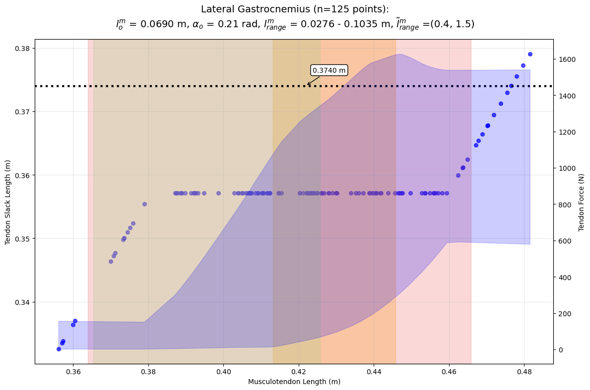
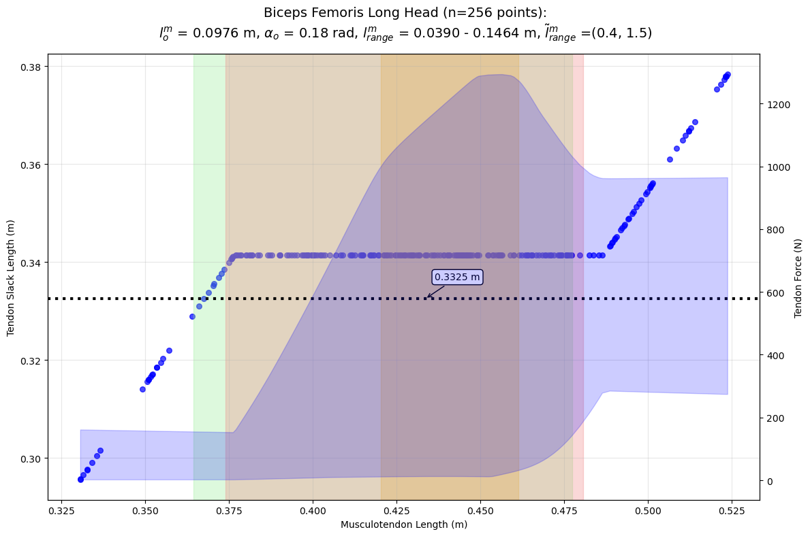
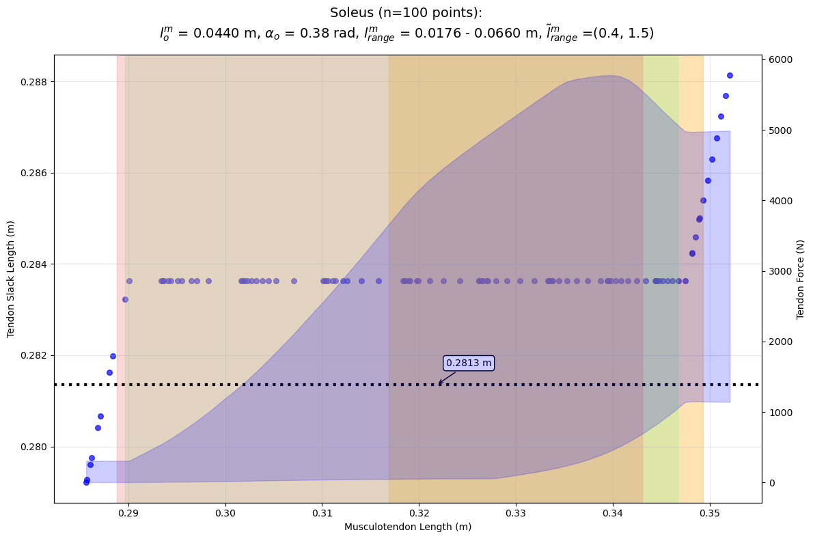

# Tendon Slack Length Optimization {#sec-tsl-optimization}

::: {.callout-note}
This chapter draws heavily from the abstract and poster presented at the American Society of Biomechanics (ASB) 2025 conference: *"Effects of error function selection and normalized fiber length range in numerical estimation of tendon slack length."* Those materials are available at the [ASB2025-TSL-Optimization repository](https://github.com/hudsonburke/ASB2025-TSL-Optimization).
:::

## Introduction

Musculoskeletal models that incorporate Hill-type muscles require the specification of several parameters to determine the forces generated by each musculotendon unit. Among these, tendon slack length ($l^t_s$) is one of the most influential, as it defines the length at which the tendon begins to produce a restorative force. Because tendons often run parallel to muscle fibers, tendon slack length cannot be measured directly and must instead be estimated indirectly.

Several approaches for estimating tendon slack length have been proposed. The widely used human lower-limb model of @rajagopalFullBodyMusculoskeletalModel2016 derives tendon slack length from the fiber length at a single, predefined joint configuration. @manalSubjectSpecificEstimatesTendon2004 proposed a more general optimization-based technique that minimizes the discrepancy among tendon slack lengths estimated across a range of musculotendon lengths, leveraging the active and passive force-length curves for the muscle fiber and the tendon force-length curve.

In this chapter, we extend the approach of @manalSubjectSpecificEstimatesTendon2004 in two ways. First, we systematically investigate the effects of normalized fiber length range and choice of error function on the estimated tendon slack lengths. Second, we evaluate the physiological plausibility of the results by examining the predicted force profiles of the musculotendon units during several different kinematic activities. The goal is to inform a robust methodology for numerically tuning tendon slack length in new musculoskeletal models.

## Methods

### Overview

The optimization follows the conceptual framework of @manalSubjectSpecificEstimatesTendon2004, using the musculotendon equilibrium equations derived by @zajacMuscleTendonProperties1989 to compute tendon slack length from known muscle parameters and interpolated force values. At each sampled musculotendon length, a candidate tendon slack length is calculated using @eq-tsl. The optimizer then searches for the tendon slack length that minimizes the spread of these candidates across all sampled lengths:

$$
l^{t}_{s} = \frac{l^{mt}-l^{m}_{o} \cdot \tilde{l}^{m}\cos(\alpha)}{\left[ 1+\frac{\text{eval}\left[\tilde{F}^{m}(\tilde{l}^{m})\right]\cos(\alpha)+0.2375}{37.5} \right]}
$$ {#eq-tsl}

where $l^{mt}$ is the musculotendon length, $l^m_o$ is the optimal fiber length, $\tilde{l}^m$ is the normalized fiber length, $\alpha$ is the pennation angle, and $\tilde{F}^m(\tilde{l}^m)$ is the normalized muscle force evaluated from the force-length curve.

### Differences from Manal's Method

Our implementation differs from the original method of @manalSubjectSpecificEstimatesTendon2004 in several respects:

- **Optimization algorithm**: We use Sequential Least Squares Programming (SLSQP) via the SciPy optimization library [@virtanenSciPy10Fundamental2020] rather than the Generalized Reduced Gradient (GRG) algorithm used by Manal, owing to its availability and widespread use in Python.
- **Force-length curves**: The active and passive fiber force-length curves as well as the tendon force-length curve were taken from the Millard muscle model [TODO: @millardFlexingComputationalMuscle2013] (@fig-millard-fl-curves) instead of Zajac's original curves.
- **Musculotendon length sampling**: Rather than sampling at only two extreme joint configurations and averaging a third intermediate value, we iterate the model through all relevant degrees of freedom to obtain a minimum of 100 musculotendon length samples per muscle.

### Muscle Selection

To demonstrate the method across muscles of differing architectures, we estimated tendon slack lengths for three muscles from the Rajagopal model [@rajagopalFullBodyMusculoskeletalModel2016] spanning a range of tendon-to-fiber ratios:

- **Lateral gastrocnemius** (gaslat) — biarticular, long tendon
- **Long head of biceps femoris** (bflh) — biarticular, moderate tendon
- **Soleus** — monoarticular, short tendon

### Error Functions {#sec-error-functions}

In addition to the sum of squared differences of pairs (SSDP) used by @manalSubjectSpecificEstimatesTendon2004, we evaluated three alternative error functions to assess their influence on the optimization:

| Error Function | Abbreviation | Formula |
|---|:---:|---|
| Sum of Squared Difference of Pairs | SSDP | $\sum_{i}\sum_{j}\left(l^{t}_{s,(i)}-l^{t}_{s,(j)}\right)^{2}$ |
| Sum of Squared Difference from Mean | SSDM | $\sum\left(l^{t}_{s,(i)}-\bar{l}^{t}_{s}\right)^{2}$ |
| Standard Deviation | STD | $\sqrt{ \frac{\sum\left(l^{t}_{s,(i)}-\bar{l}^{t}_{s}\right)^{2}}{n} }$ |
| Variance | VAR | $\frac{\sum\left(l^{t}_{s,(i)}-\bar{l}^{t}_{s}\right)^{2}}{n}$ |

: Error functions evaluated for tendon slack length optimization. {#tbl-error-functions}

### Normalized Fiber Length Ranges

The optimization was performed under three different normalized fiber length ranges to assess the sensitivity of the results:

1. **Full range** (0.4--1.5): Captures the main force-producing portion of the fiber force-length curve.
2. **Gait operating range**: Estimates of each muscle's operating range during gait as reported by Arnold [TODO: add citation].
3. **Ascending limb only**: Restricted to the ascending portion of the force-length curve, following the approach of @manalSubjectSpecificEstimatesTendon2004.

SLSQP minimization from SciPy [@virtanenSciPy10Fundamental2020] was then used to minimize each error function over the calculated tendon slack lengths at each musculotendon length.

## Results

### Tendon Slack Length Estimates

Using the model's full range of motion, we generated 125 musculotendon length samples for gaslat, 256 for bflh, and 100 for soleus (481 total). Across all muscles, SSDP optimization produced relatively stable tendon slack length estimates over broad musculotendon length ranges, as summarized in @tbl-tsl-results.

| Muscle | MT length range (m) | SSDP TSL range (m) | SSDP TSL mean $\pm$ SD (m) | CV (%) | Corr. $r$(MT, TSL) |
|---|---:|---:|---:|---:|---:|
| gaslat | 0.3561--0.4815 | 0.3326--0.3790 | 0.3571 $\pm$ 0.0068 | 1.89 | 0.7613 |
| bflh | 0.3307--0.5238 | 0.2956--0.3784 | 0.3414 $\pm$ 0.0125 | 3.66 | 0.7670 |
| soleus | 0.2857--0.3521 | 0.2792--0.2881 | 0.2836 $\pm$ 0.0013 | 0.47 | 0.6232 |

: Tendon slack length estimates by SSDP optimization for three muscles from the Rajagopal model. {#tbl-tsl-results}

Compared with the values reported by @rajagopalFullBodyMusculoskeletalModel2016 (gaslat: 0.3740 m, bflh: 0.3325 m, soleus: 0.2813 m), the SSDP means were lower for gaslat and slightly higher for bflh and soleus, while all Rajagopal values fell within the estimated TSL range for the respective muscle.

### Coordinate Dependence

The dependence of musculotendon length on joint coordinates was muscle-specific. For gaslat, the strongest relationships were with ankle angle ($r=0.7562$) and knee angle ($r=-0.6442$). For bflh, hip flexion ($r=0.8102$) and knee angle ($r=-0.5237$) were dominant. For soleus, ankle angle showed a near-monotonic relationship ($r=0.9919$), while subtalar angle had minimal influence ($r=-0.0546$). The corresponding plots are included in @sec-rajagopal-mtl.

### Activity-Specific Force Profiles

When overlaid with activity-specific musculotendon length ranges (walking, squatting, and cutting), most functional ranges fell in regions where TSL estimates were comparatively flat. However, some activities approached edge regions where tendon force rose rapidly, particularly for soleus and the long-length end of bflh (@fig-tsl-gaslat; @fig-tsl-bflh; @fig-tsl-soleus).

{#fig-tsl-gaslat}

{#fig-tsl-bflh}

{#fig-tsl-soleus}

## Discussion

### Effect of Error Function

Across all three muscles, the choice of error function had negligible influence on the optimized tendon slack length. All four formulations---SSDP, SSDM, STD, and VAR---converged to nearly identical estimates. This is consistent with the fact that each function penalizes the spread of the candidate TSL values, differing only in how the spread is aggregated. From a practical standpoint, any of these error functions can be used interchangeably, though SSDP remains the default given its precedent in the literature.

### Effect of Normalized Fiber Length Range

In contrast to the error function, the normalized fiber length range used during optimization had a substantial effect on the estimated tendon slack lengths. The full range (0.4--1.5) produced the most stable estimates across musculotendon lengths, while narrower ranges led to greater sensitivity to the specific lengths sampled. This finding underscores the importance of carefully selecting the fiber length range when applying this methodology to new models or muscles.

### Activity Dependence

The tendon slack length plots in @fig-tsl-gaslat through @fig-tsl-soleus show the estimates produced by SSDP optimization across a normalized fiber length range of 0.4 to 1.5, along with the corresponding tendon force envelope. The highlighted regions indicate the range of musculotendon lengths encountered during walking, squatting, and athletic cutting motions. For most muscles and activities, the functional musculotendon length range falls in a region where the TSL estimate is relatively flat and the tendon force is moderate. However, when the musculotendon length approaches the extremes of its range---as occurs for soleus during cutting or for the long-length end of bflh---the tendon force rises steeply and the TSL estimate becomes less stable. This suggests that a single optimized tendon slack length may introduce activity-dependent inaccuracies for muscles that operate near the boundaries of their length range. For example, the soleus TSL estimate that performs well for squatting may be less appropriate for an athletic cutting motion.

## Application to Rodent Model

As discussed in @sec-musc-params, many muscles in the rat hindlimb model lacked values for tendon slack length or had unreliable values, preventing muscle-level analyses such as computed muscle control. To address this, we applied the tendon slack length optimization methodology described above to estimate tendon slack lengths for all muscles in the rat hindlimb model.

Given the more limited availability of rodent muscle parameter data compared to human models, the optimization was performed using only the full normalized fiber length range (0.4--1.5) and the SSDP error function. For the musculotendon length sampling, we compared two approaches: the model's full range of motion and the observed range of motion during normal gait, compiled from baseline walking trials in the study detailed in @sec-rat-vml. The results, compared with the parameters from @johnsonApplicationRatHindlimb2011, are summarized in @tbl-tsl-comparison.



We selected the tendon slack lengths optimized from observed gait kinematics for use in the final model, as the model's full range of motion includes physiologically infeasible joint configurations that would bias the optimization.
